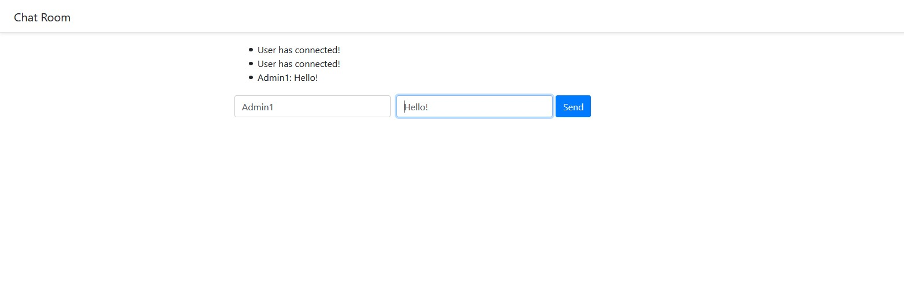
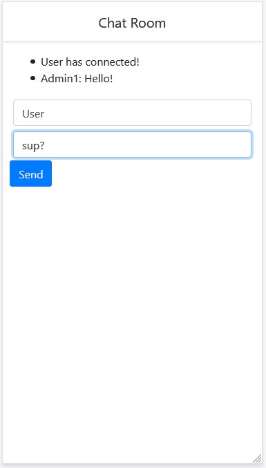
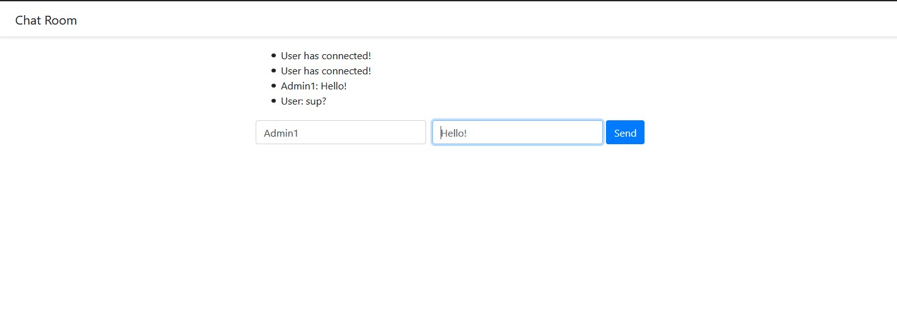

# flask-socketio-sample-chatapp
Sample Chat App using Flask SocketIO

On Desktop



On Android



On Dekstop



## Prerequisite
Python 3

## Setup
```bash
python -m pip install --upgrade -r requirements.txt
```

## Running
```bash
python app.py
```
